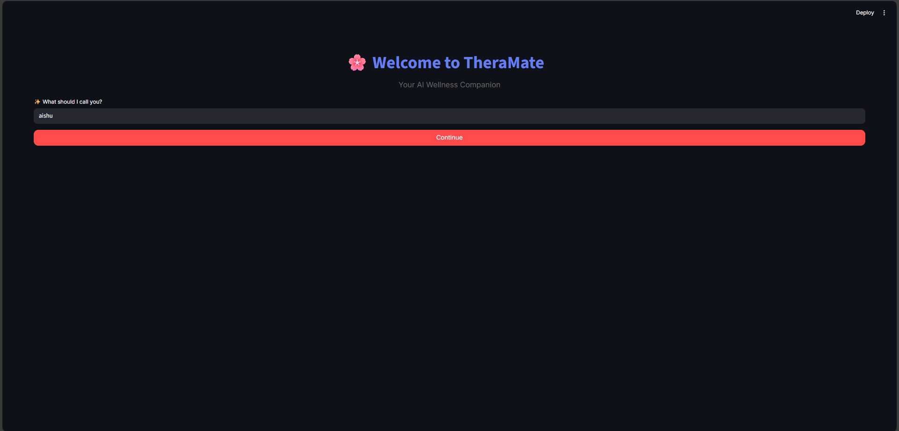
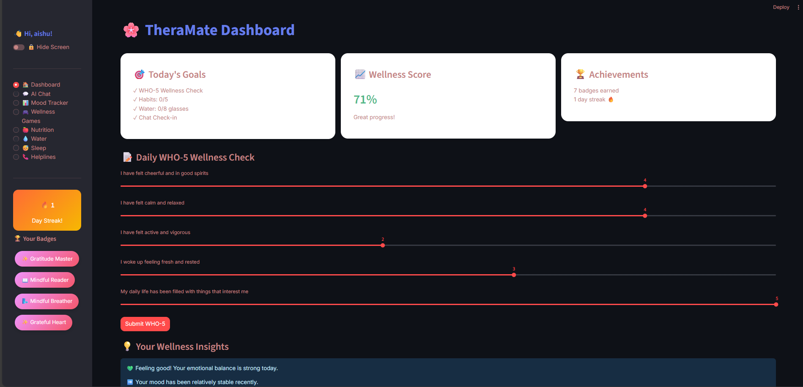
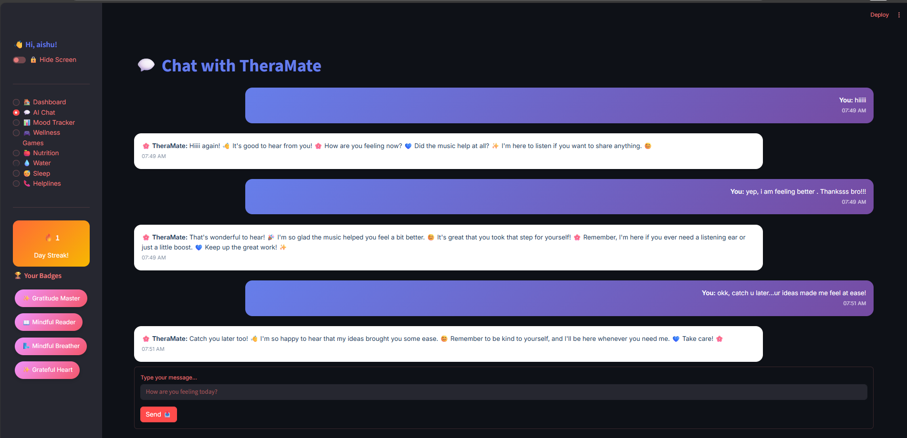
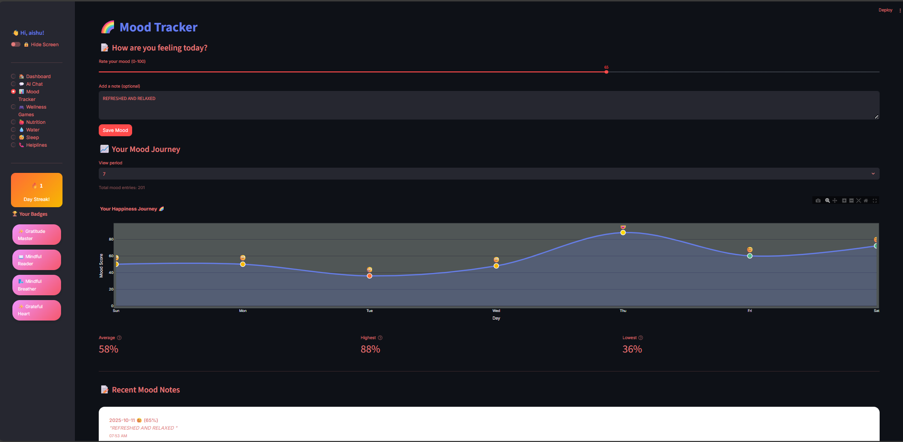
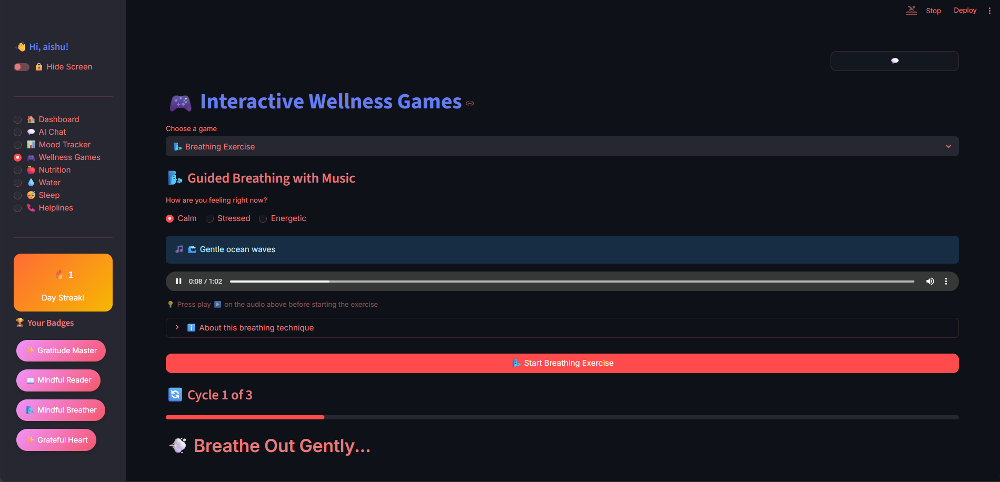
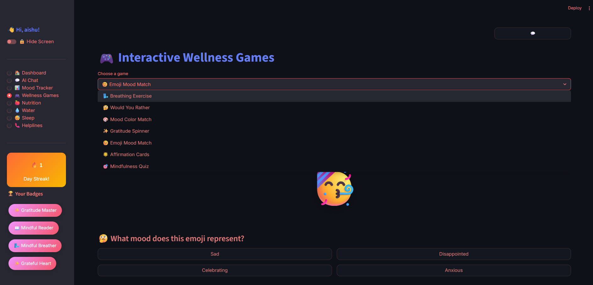
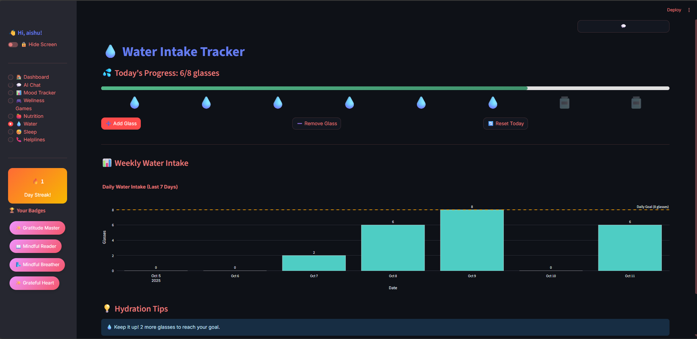
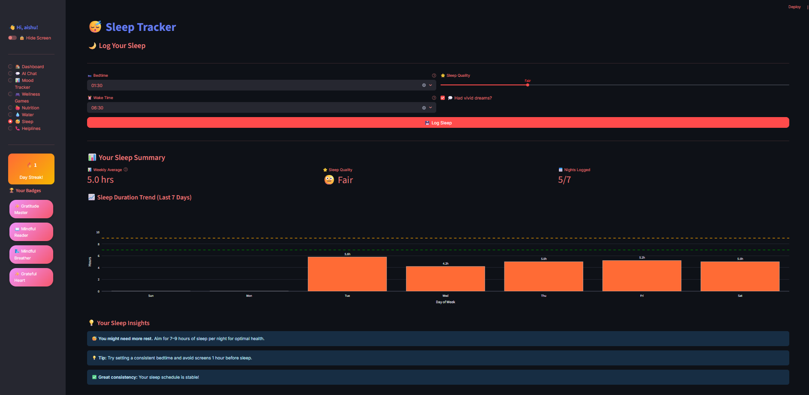
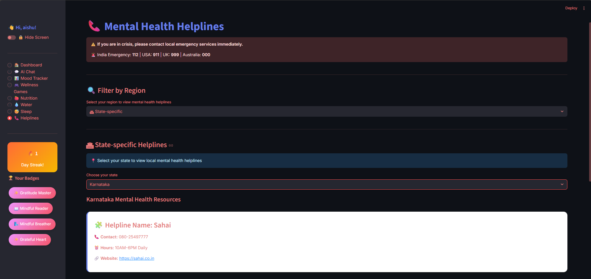

# 🌸 TheraMate - Your AI Wellness Companion

<div align="center">


**A compassionate AI-powered mental wellness companion that helps you track moods, build healthy habits, and find support when you need it most.**

[](https://www.python.org/downloads/)
[](https://streamlit.io/)
[](LICENSE)
[](https://ai.google.dev/)
[]()

[Features](#-features) • [Installation](#-installation--setup) • [Screenshots](#%EF%B8%8F-screenshots) • [Tech Stack](#-tech-stack) • [Contributing](#-contributing)

</div>

---

## 💙 About TheraMate

**TheraMate** is more than just an app—it's your personal sanctuary for mental wellness. Built with compassion and powered by AI, TheraMate creates a safe, judgment-free space where you can:

- 🗣️ **Talk freely** with an empathetic AI companion
- 📊 **Track your emotions** using the WHO-5 Wellness Index
- 🎯 **Build positive habits** with daily goals and streaks
- 🎮 **Play wellness games** designed to boost your mood
- 🍎 **Monitor nutrition**, 💧 hydration, and 😴 sleep
- 📞 **Access crisis helplines** instantly when you need support

> *"Mental health is not a destination, but a journey. Let TheraMate walk alongside you."* 🌈

---

## ✨ Features

<table>
<tr>
<td width="50%" valign="top">

### 🏠 Smart Dashboard
- Real-time wellness score
- Daily WHO-5 check-in
- Streak tracking 🔥
- Achievement badges 🏆

### 💬 AI Chat Companion
- Google Gemini AI powered
- Context-aware responses
- Quick chat floating button
- Beautiful typing animations

### 📊 Mood Tracker
- Visual mood journey graphs
- 0-100 mood rating
- Weekly/monthly trends
- Emoji-coded insights
- Optional mood notes

</td>
<td width="50%" valign="top">

### 🎮 Interactive Wellness Games
- 🌬️ Breathing exercises
- 🤔 Would you rather
- 🎨 Mood color match
- ✨ Gratitude spinner
- 😊 Emoji mood match
- 🌟 Affirmation cards
- 🎯 Mindfulness quiz

### 🍎 Health Trackers
- **Nutrition**: 80+ foods database
- **Water**: 8 glasses/day goal
- **Sleep**: Duration & quality logs

### 📞 Crisis Support
- Global helplines database
- Region-specific resources
- 24/7 emergency contacts

</td>
</tr>
</table>

---

## 🖼️ Screenshots

<details>
<summary>📸 Click to view all screenshots</summary>

### 🎉 Welcome Screen


### 🏠 Dashboard


### 💬 AI Chat Interface


### 📊 Mood Tracker


### 🎮 Wellness Games
<table>
<tr>
<td></td>
<td></td>
</tr>
</table>

### 📈 Health Tracking
<table>
<tr>
<td></td>
<td></td>
<td></td>
</tr>
</table>

### 📞 Crisis Helplines


</details>

---

## 🚀 Installation & Setup

### Prerequisites

- **Python 3.9+** ([Download](https://www.python.org/downloads/))
- **pip** (Python package manager)
- **Google Gemini API key** ([Get free API key](https://ai.google.dev/))

### Quick Start

```bash
# 1️⃣ Clone the repository
git clone https://github.com/yourusername/theramate.git
cd theramate

# 2️⃣ Create virtual environment
python -m venv venv

# Activate it:
# Windows:
venv\Scripts\activate
# macOS/Linux:
source venv/bin/activate

# 3️⃣ Install dependencies
pip install -r requirements.txt

# 4️⃣ Configure API keys
# Create src/.env file:
echo "GEMINI_API_KEY=your_api_key_here" > src/.env

# 5️⃣ Run the app
cd src
streamlit run app.py
```

### 🎉 Access the App

Open browser: **http://localhost:8501**

**Default PIN**: `1234`

---

## 💻 Tech Stack

<div align="center">

| Category | Technologies |
|:--------:|:-------------|
| **Frontend** |  Custom CSS/HTML, Plotly |
| **Backend** |  3.9+ |
| **AI/ML** |  gemini-1.5-flash |
| **Data** | JSON (local storage) |
| **Charts** |  Graph Objects |

</div>

### 📦 Key Dependencies

```txt
streamlit>=1.28.0           # Web framework
google-generativeai         # Gemini AI
plotly>=5.17.0             # Interactive charts
python-dotenv              # Environment variables
```

---

## 🧩 Project Structure

```
MENTAL_HEALTH_APP/
├── images/                        # Screenshots & assets
│   ├── welcome.png
│   ├── dashboard.png
│   ├── ai_chat.png
│   ├── mood_tracker.png
│   ├── wellness_games.png
│   ├── wellness_games1.png
│   ├── nutrition_tracker.png
│   ├── water_intake_tracker.png
│   ├── sleep_tracker.png
│   └── helplines.png
│
├── audio/                         # Background music
│   ├── ocean_waves.mp3
│   ├── soft_piano.mp3
│   └── upbeat_ambient.mp3
│
├── src/                           # Source code
│   ├── app.py                    # Main Streamlit app
│   ├── llm_adapter.py            # Gemini AI integration
│   ├── .env                      # API keys (create this)
│   ├── exercises.json
│   ├── gratitude.json
│   └── helplines.json
│
├── data/                          # User data (auto-generated)
│   └── .gitkeep
│
├── .gitignore
├── README.md
├── requirements.txt
└── LICENSE
```

### 📂 File Descriptions

<table>
<tr>
<th>Folder/File</th>
<th>Description</th>
</tr>
<tr>
<td><code>images/</code></td>
<td>App screenshots for documentation</td>
</tr>
<tr>
<td><code>audio/</code></td>
<td>MP3 files for breathing exercises (optional)</td>
</tr>
<tr>
<td><code>src/app.py</code></td>
<td>⭐ Main application (18,000+ lines)</td>
</tr>
<tr>
<td><code>src/llm_adapter.py</code></td>
<td>⭐ AI functions & helpers</td>
</tr>
<tr>
<td><code>src/.env</code></td>
<td>🔒 API keys (you must create this)</td>
</tr>
<tr>
<td><code>data/</code></td>
<td>Folder for user data (auto-created)</td>
</tr>
</table>

### 🗂️ User Data Files (Auto-Generated)

These JSON files are created automatically when you use the app:

<table>
<tr>
<th>File</th>
<th>Content</th>
</tr>
<tr>
<td><code>badges.json</code></td>
<td>Achievement badges earned</td>
</tr>
<tr>
<td><code>mood.json</code></td>
<td>Mood tracking history</td>
</tr>
<tr>
<td><code>nutrition.json</code></td>
<td>Meal logs</td>
</tr>
<tr>
<td><code>water_log.json</code></td>
<td>Hydration tracking</td>
</tr>
<tr>
<td><code>sleep_log.json</code></td>
<td>Sleep records</td>
</tr>
<tr>
<td><code>games.json</code></td>
<td>Game history</td>
</tr>
<tr>
<td><code>session_history.json</code></td>
<td>Chat conversation logs</td>
</tr>
</table>

> ⚠️ **Note**: All user data files are automatically excluded from Git for privacy

---

## 🎯 WHO-5 Wellness Index

TheraMate uses the **WHO-5 Well-Being Index**, a scientifically validated questionnaire:

<table>
<tr>
<th>#</th>
<th>Question</th>
</tr>
<tr>
<td>1</td>
<td>I have felt cheerful and in good spirits</td>
</tr>
<tr>
<td>2</td>
<td>I have felt calm and relaxed</td>
</tr>
<tr>
<td>3</td>
<td>I have felt active and vigorous</td>
</tr>
<tr>
<td>4</td>
<td>I woke up feeling fresh and rested</td>
</tr>
<tr>
<td>5</td>
<td>My daily life has been filled with things that interest me</td>
</tr>
</table>

**Scoring System**: 
- Each question: 0-5 scale
- Total score: Converted to 0-100% wellness score
- Higher scores indicate better wellbeing

---

## 🎮 Wellness Games Deep Dive

<table>
<tr>
<th>Game</th>
<th>Description</th>
<th>Benefits</th>
</tr>
<tr>
<td>🌬️ <strong>Breathing Exercise</strong></td>
<td>Guided box breathing with ambient music (calm/stressed/energetic moods)</td>
<td>Reduces stress, improves focus, instant relaxation</td>
</tr>
<tr>
<td>🤔 <strong>Would You Rather</strong></td>
<td>Fun decision-making scenarios with personalized feedback</td>
<td>Lightens mood, sparks reflection, self-discovery</td>
</tr>
<tr>
<td>🎨 <strong>Mood Color Match</strong></td>
<td>Match colors to your current emotions (8 colors)</td>
<td>Emotional awareness, creative expression</td>
</tr>
<tr>
<td>✨ <strong>Gratitude Spinner</strong></td>
<td>Animated wheel with 15 gratitude prompts + reflection</td>
<td>Cultivates positivity, mindfulness practice</td>
</tr>
<tr>
<td>😊 <strong>Emoji Mood Match</strong></td>
<td>5-round quiz matching emojis to moods with scoring</td>
<td>Emotional intelligence, pattern recognition</td>
</tr>
<tr>
<td>🌟 <strong>Affirmation Cards</strong></td>
<td>Random positive affirmations with beautiful animations</td>
<td>Boosts self-esteem, positive self-talk</td>
</tr>
<tr>
<td>🎯 <strong>Mindfulness Quiz</strong></td>
<td>10-question self-assessment with personalized results</td>
<td>Measures mindfulness, provides insights</td>
</tr>
</table>

---

## 🛡️ Privacy & Security

<div align="center">

| Feature | Description |
|:-------:|:------------|
| 🔐 | **PIN Protection** - Secure access (changeable) |
| 💾 | **Local Storage** - No cloud uploads |
| 🙈 | **Hide Screen Mode** - Instant privacy toggle |
| 🚫 | **No Tracking** - Zero data collection |
| 🔒 | **Encrypted API** - Secure Gemini communication |

</div>

**Your data stays on your device** (except AI queries to Gemini)

---

## 🤝 Contributing

We welcome contributions! Here's how you can help:

### Ways to Contribute

- 🐛 **Report Bugs** → [Submit Issue](https://github.com/yourusername/theramate/issues)
- 💡 **Suggest Features** → [New Discussion](https://github.com/yourusername/theramate/discussions)
- 📝 **Improve Docs** → Edit README
- 🔧 **Submit PRs** → See guidelines below
- ⭐ **Star the Repo** → Show support!

### Contribution Guidelines

```bash
# 1. Fork the repository
# 2. Create feature branch
git checkout -b feature/AmazingFeature

# 3. Commit your changes
git commit -m 'Add: AmazingFeature'

# 4. Push to branch
git push origin feature/AmazingFeature

# 5. Open Pull Request
```

### Priority Areas

- 🌐 Multi-language support
- 📱 Mobile responsiveness
- 🎨 New wellness games
- 🗺️ More international helplines
- 🧪 Unit tests
- 📚 Better documentation

---

## 🗺️ Roadmap

### ✅ Version 1.0 (Current)
- [x] AI chat with Gemini
- [x] WHO-5 mood tracking
- [x] 7 interactive games
- [x] Health trackers (nutrition, water, sleep)
- [x] Crisis helplines database

### 🔄 Version 1.1 (In Progress)
- [ ] Export data feature
- [ ] Dark mode theme
- [ ] Voice chat with AI
- [ ] Medication reminders

### 🚀 Version 2.0 (Planned)
- [ ] Mobile app (React Native)
- [ ] Multi-user profiles
- [ ] Community support forums
- [ ] Therapist matching
- [ ] Wearable device integration
- [ ] Mood prediction ML model

---

## ⚠️ Important Disclaimers

<div align="center">

### 🚨 TheraMate is NOT a replacement for professional mental health care

</div>

| Situation | Action |
|-----------|--------|
| **🆘 In Crisis** | Call **112** (India), **988** (USA), or local emergency |
| **😟 Serious Concerns** | Consult licensed mental health professionals |
| **💊 Medical Advice** | This app does NOT diagnose or treat conditions |
| **🤝 Best Use** | Supportive tool alongside professional care |

---

## 📞 Crisis Resources

<div align="center">

### If you or someone you know needs immediate help:

| Country | Service | Contact |
|:-------:|:--------|:-------:|
| 🇮🇳 India | AASRA | [91-22-27546669](tel:912227546669) |
| 🇮🇳 India | Vandrevala | [1860-2662-345](tel:18602662345) |
| 🇺🇸 USA | 988 Lifeline | [988](tel:988) |
| 🇬🇧 UK | Samaritans | [116 123](tel:116123) |
| 🇦🇺 Australia | Lifeline | [13 11 14](tel:131114) |
| 🇨🇦 Canada | Crisis Services | [1-833-456-4566](tel:18334564566) |

**Available 24/7** | **Free & Confidential**

</div>

---

## 📜 License

This project is licensed under the **MIT License**

```
MIT License

Copyright (c) 2025 TheraMate

Permission is hereby granted, free of charge, to any person obtaining a copy
of this software and associated documentation files (the "Software"), to deal
in the Software without restriction, including without limitation the rights
to use, copy, modify, merge, publish, distribute, sublicense, and/or sell
copies of the Software...
```

See [LICENSE](LICENSE) file for full details.

---

## 🙏 Acknowledgments

**This project wouldn't exist without:**

- 🤖 **[Google Gemini AI](https://ai.google.dev/)** - Powering empathetic conversations
- 🎨 **[Streamlit](https://streamlit.io/)** - Making beautiful web apps accessible
- 📊 **[Plotly](https://plotly.com/)** - Interactive data visualization
- 🏥 **[WHO](https://www.who.int/)** - WHO-5 Well-Being Index
- 💙 **Mental health advocates** - Fighting stigma worldwide

**Special thanks to all contributors and supporters!**

---

## 📬 Contact & Support

<div align="center">

**Developer**: [Your Name]

[](https://github.com/yourusername)
[](https://linkedin.com/in/yourprofile)
[](mailto:your.email@example.com)

### Get Help

📖 [Documentation](https://github.com/yourusername/theramate/wiki) • 
🐛 [Report Bug](https://github.com/yourusername/theramate/issues) • 
💬 [Discussions](https://github.com/yourusername/theramate/discussions) • 
❓ [FAQ](https://github.com/yourusername/theramate/wiki/FAQ)

</div>

---

## 🌟 Star History

[](https://star-history.com/#yourusername/theramate&Date)

---

## 📊 Stats

<div align="center">


</div>

---

<div align="center">

### 💙 Built with love for mental wellness

**Remember: You are not alone. You are worthy. You are enough.**

*It's okay to not be okay. Reach out for help when you need it.* 🌈

---

**[⬆ Back to Top](#-theramate---your-ai-wellness-companion)**

<sub>Made with 💙 by [Your Name] • © 2025 TheraMate</sub>

</div>