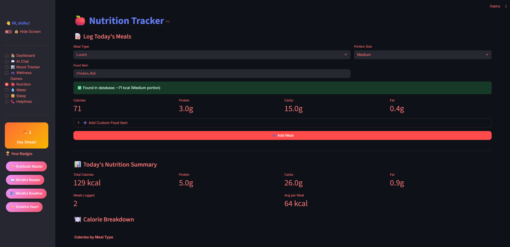

# 🌸 TheraMate - Your AI Wellness Companion

<div align="center">


**A compassionate AI-powered mental wellness companion that helps you track moods, build healthy habits, and find support when you need it most.**

[](https://www.python.org/downloads/)
[](https://streamlit.io/)
[](LICENSE)
[](https://ai.google.dev/)
[]()

[Features](#-features) • [Installation](#-installation--setup) • [Tech Stack](#-tech-stack) • 

</div>

---

## 💙 About TheraMate

**TheraMate** is more than just an app—it's your personal sanctuary for mental wellness. Built with compassion and powered by AI, TheraMate creates a safe, judgment-free space where you can:

- 🗣️ **Talk freely** with an empathetic AI companion
- 📊 **Track your emotions** using the WHO-5 Wellness Index
- 🎯 **Build positive habits** with daily goals and streaks
- 🎮 **Play wellness games** designed to boost your mood
- 🍎 **Monitor nutrition**, 💧 hydration, and 😴 sleep
- 📞 **Access crisis helplines** instantly when you need support

> *"Mental health is not a destination, but a journey. Let TheraMate walk alongside you."* 🌈

---

## ✨ Features

### 🏠 **Smart Dashboard**
- Real-time wellness score based on your activities
- Daily WHO-5 wellness check-in
- Streak tracking to celebrate consistency
- Achievement badges for milestones

### 💬 **AI Chat Companion**
- Powered by **Google Gemini AI** for empathetic conversations
- Context-aware responses based on your mood history
- Quick chat floating button for instant support
- Beautiful typing animations for engaging interactions

### 📊 **Mood Tracker**
- Visual mood journey graphs with emojis
- Rate your mood (0-100) with optional notes
- Weekly, bi-weekly, and monthly trend analysis
- Color-coded insights (Happy 😄 | Calm 😊 | Neutral 😐 | Sad 😢)
- Instant graph updates after logging mood

### 🎮 **Interactive Wellness Games**

| Game | Description | Benefits |
|------|-------------|----------|
| 🌬️ **Breathing Exercise** | Guided box breathing with ambient music | Reduces stress, improves focus |
| 🤔 **Would You Rather** | Fun decision-making scenarios | Lightens mood, sparks reflection |
| 🎨 **Mood Color Match** | Match colors to your emotions | Emotional awareness |
| ✨ **Gratitude Spinner** | Spinning wheel with gratitude prompts | Cultivates positivity |
| 😊 **Emoji Mood Match** | Match emojis to moods (quiz) | Emotional intelligence |
| 🌟 **Affirmation Cards** | Random positive affirmations | Boosts self-esteem |
| 🎯 **Mindfulness Quiz** | 10-question self-assessment | Measures mindfulness levels |

### 🍎 **Nutrition Tracker**
- **Enhanced calorie database** with Indian & international foods
- Auto-suggestions as you type (e.g., "vada pav", "biryani", "dosa")
- Portion size adjustments (Small, Medium, Large)
- Macronutrient breakdown (Protein, Carbs, Fat)
- Custom food entry option
- Weekly calorie trend charts
- Meal type categorization (Breakfast, Lunch, Dinner, Snack)

### 💧 **Water Intake Tracker**
- Visual glass tracker (8 glasses/day goal)
- One-click add/remove buttons
- Weekly hydration trends
- Progress bar with percentage
- Hydration tips and reminders

### 😴 **Sleep Tracker**
- Log bedtime and wake time
- Automatic sleep duration calculation
- Sleep quality rating (Poor → Excellent)
- Dream tracking
- Weekly sleep trend graphs
- Color-coded sleep insights (Green = 8+ hrs, Yellow = 6-8 hrs, Red = <6 hrs)
- Personalized sleep recommendations

### 📞 **Crisis Support Helplines**
- **Mental health helplines** categorized by region
- International, India-wide, state-specific, and city-specific options
- 24/7 emergency contacts highlighted
- Direct links to helpline websites
- Includes USA (988), UK (Samaritans), Australia (Lifeline), India (AASRA, Vandrevala)

### 🏆 **Achievement System**
- Earn badges for milestones (e.g., "Wellness Star ⭐", "7-Day Streak 🔥")
- Badge gallery in sidebar
- Celebratory animations when unlocking achievements

### 🔒 **Privacy & Security**
- PIN-protected access (default: 1234)
- Hide screen mode for instant privacy
- Consent flow before usage
- All data stored locally (no cloud uploads)

---

## 🧠 How It Works


1. **Onboarding**: Enter nickname → Consent agreement → PIN authentication
2. **Daily Check-in**: Complete WHO-5 wellness questionnaire
3. **Track & Monitor**: Log mood, meals, water, sleep
4. **AI Support**: Chat with empathetic AI companion
5. **Play & Reflect**: Engage in wellness games
6. **Get Help**: Access helplines if in crisis

---

## 💻 Tech Stack

<div align="center">

| Category | Technologies |
|----------|-------------|
| **Frontend** | Streamlit, Custom CSS/HTML, Plotly |
| **Backend** | Python 3.9+ |
| **AI/ML** | Google Gemini AI (gemini-1.5-flash) |
| **Data Storage** | JSON (local files) |
| **Visualization** | Plotly Graph Objects, Mermaid |
| **Audio** | HTML5 Audio with base64 encoding |

</div>

### Key Libraries

```python
streamlit>=1.28.0      # Web framework
google-generativeai    # Gemini AI integration
plotly>=5.17.0        # Interactive charts
python-dotenv         # Environment variables
```

---

## 🚀 Installation & Setup

### Prerequisites

- Python 3.9 or higher
- pip (Python package manager)
- Google Gemini API key ([Get it here](https://ai.google.dev/))

### Step 1: Clone the Repository

```bash
git clone https://github.com/yourusername/theramate.git
cd theramate
```

### Step 2: Create Virtual Environment

```bash
# Windows
python -m venv venv
venv\Scripts\activate

# macOS/Linux
python3 -m venv venv
source venv/bin/activate
```

### Step 3: Install Dependencies

```bash
pip install -r requirements.txt
```

### Step 4: Configure API Keys

Create a `.env` file in the `src/` directory:

```env
GEMINI_API_KEY=your_gemini_api_key_here
```

⚠️ **Never commit `.env` to Git!**

### Step 5: Add Audio Files (Optional)

Place these audio files in `audio/` folder for breathing exercises:
- `ocean_waves.mp3` (Calm mood)
- `soft_piano.mp3` (Stressed mood)
- `upbeat_ambient.mp3` (Energetic mood)

### Step 6: Run the App

```bash
cd src
streamlit run app.py
```

The app will open at `http://localhost:8501` 🎉

---

## 🖼️ Screenshots

<div align="center">

### 🎉 Welcome Screen


### 🏠 Dashboard


### 💬 AI Chat Interface


### 📊 Mood Tracker


### 🎮 Wellness Games


### 🍎 Nutrition Tracker


### 💧 Water Intake Tracker


### 😴 Sleep Tracker


### 📞 Crisis Helplines


</div>

---

## 🧩 Project Structure

```

MENTAL_HEALTH_APP/
│
├── 📁 images/                     # Screenshots & assets
│   ├── 🖼️ welcome.png            # Welcome screen
│   ├── 🖼️ dashboard.png          # Dashboard view
│   ├── 🖼️ ai_chat.png            # AI chat interface
│   ├── 🖼️ mood_tracker.png       # Mood tracking graph
│   ├── 🖼️ wellness_games.png     # Games menu
│   ├── 🖼️ wellness_games1.png    # Game demo
│   ├── 🖼️ nutrition_tracker.png  # Nutrition logs
│   ├── 🖼️ water_intake_tracker.png # Water tracking
│   ├── 🖼️ sleep_tracker.png      # Sleep monitoring
│   └── 🖼️ helplines.png          # Crisis support
│
├── 📁 audio/                      # Background music for exercises
│   ├── 🎵 ocean_waves.mp3        # Calm mood music
│   ├── 🎵 soft_piano.mp3         # Stressed mood music
│   └── 🎵 upbeat_ambient.mp3     # Energetic mood music
│
├── 📁 src/                        # Source code
│   ├── 🐍 app.py                 # ⭐ Main Streamlit app
│   ├── 🐍 llm_adapter.py         # ⭐ Gemini AI integration
│   ├── 📄 .env                   # API keys (NEVER COMMIT!)
│   ├── 📄 exercises.json         # Exercise data
│   ├── 📄 gratitude.json         # Gratitude prompts
│   └── 📄 helplines.json         # Crisis helplines
│
├── 📁 data/                       # User data (ignored by Git)
│
├── 📄 .gitignore                 # Git ignore rules
├── 📄 README.md                  # This file
├── 📄 requirements.txt           # Python dependencies
└── 📄 LICENSE                    # MIT License
```

### User Data Files (Auto-generated)

```
badges.json          # Achievement badges
mood.json           # Mood history
nutrition.json      # Meal logs
water_log.json      # Hydration tracking
sleep_log.json      # Sleep records
games.json          # Game history
session_history.json # Chat logs
```

---

## 🎯 WHO-5 Wellness Index

TheraMate uses the **WHO-5 Well-Being Index**, a scientifically validated questionnaire:

1. I have felt cheerful and in good spirits
2. I have felt calm and relaxed
3. I have felt active and vigorous
4. I woke up feeling fresh and rested
5. My daily life has been filled with things that interest me

**Scoring**: 0-5 scale per question → Converted to 0-100% wellness score

---

## 🛡️ Privacy & Safety

- ✅ **No data collection** - Everything stored locally
- ✅ **No user tracking** - Your data stays on your device
- ✅ **Not a replacement** for professional therapy
- ✅ **Crisis resources** available 24/7
- ⚠️ **Disclaimer**: TheraMate is a supportive tool, not medical advice


---

## 🌟 Roadmap

- [ ] Voice chat with AI companion
- [ ] Mood prediction using ML
- [ ] Community support forums
- [ ] Therapist matching

---

## 💖 Acknowledgments

**Inspiration**: This project was born from the belief that mental health support should be accessible, judgment-free, and empowering.

**Special Thanks To**:
- **Google Gemini AI** for powering empathetic conversations
- **Streamlit** for making beautiful web apps simple
- **WHO** for the WHO-5 Well-Being Index
- **Mental health advocates** worldwide fighting stigma

---

<div align="center">

### 🌈 Remember: It's okay to not be okay.

**You are not alone. You are worthy. You are enough.** 💙

If you or someone you know is in crisis, please reach out:

🇮🇳 **India**: AASRA - 91-22-27546669 (24/7)  
🇺🇸 **USA**: 988 Suicide & Crisis Lifeline  
🇬🇧 **UK**: Samaritans - 116 123  
🇦🇺 **Australia**: Lifeline - 13 11 14

---

Crafted with 💙 for your well-being.

</div>